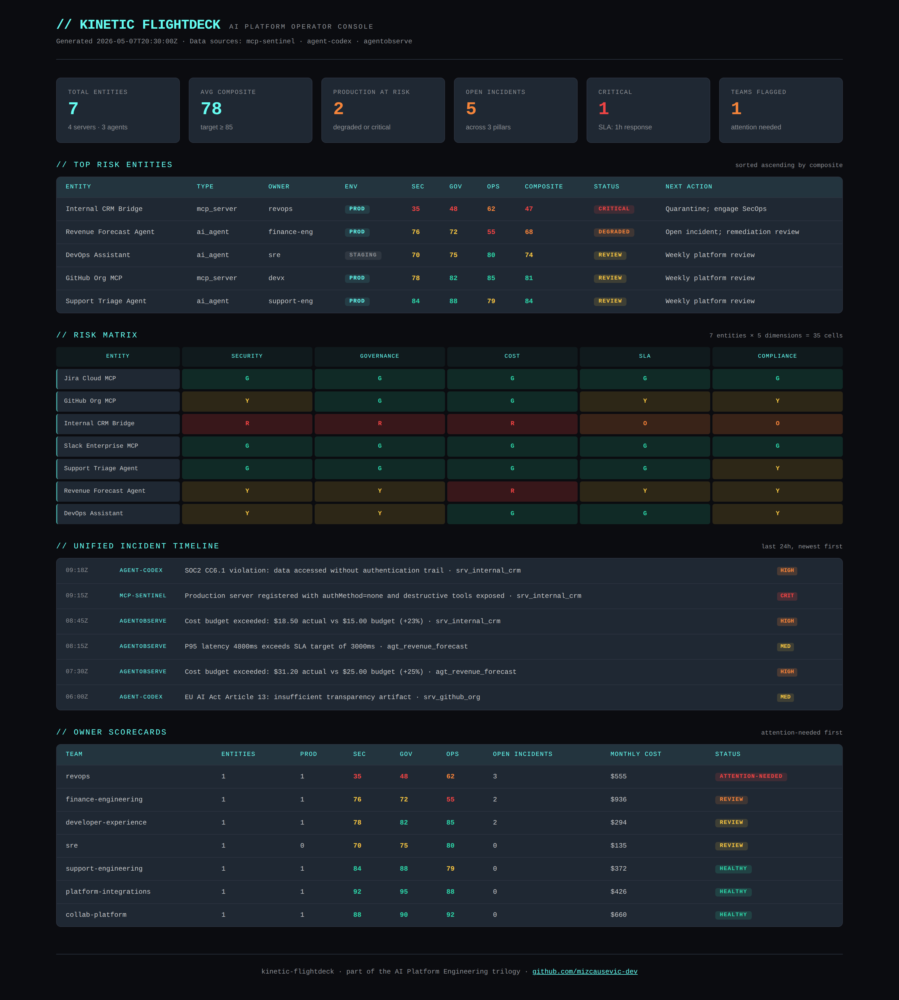

# Kinetic Flightdeck

[](https://github.com/mizcausevic-dev/kinetic-flightdeck/actions/workflows/ci.yml)
[](https://nodejs.org)
[](https://www.typescriptlang.org)
[](LICENSE)

Unified ops console for AI Platform Engineering — aggregates **MCP server posture**, **governance decisions**, and **agent fleet observability** into a single pane of glass that platform PMs, CISOs, and SRE leads can scan in 30 seconds.

> Recruiter takeaway:
>
> *"This person doesn't think of MCP governance, AI policy enforcement, and agent observability as three products. They treat them as one platform layer with one operator surface — which is exactly how enterprises buy this stuff."*

## Why This Exists

Once an enterprise is running 6–10 MCP servers, a handful of agent fleets, and a governance overlay, leadership has three different dashboards to check before standup. Flightdeck is the meta-layer that **rolls those dashboards up into one operator view** — composite posture per entity, unified incident feed across pillars, accountability by owning team, and a Monday-morning summary that fits on one screen.

This repo is the third pillar in a trilogy:

| Repo | Layer | Question it answers |
|---|---|---|
| [`mcp-sentinel`](https://github.com/mizcausevic-dev/mcp-sentinel) | Tool surface | *What MCP tools are exposed and how risky are they?* |
| [`agent-codex`](https://github.com/mizcausevic-dev/agent-codex) | Control plane | *Under what policies are decisions allowed?* |
| [`agentobserve`](https://github.com/mizcausevic-dev/agentobserve) | Runtime | *What did agents actually do — cost, latency, outcomes?* |
| **`kinetic-flightdeck`** | **Operator surface** | ***Are we OK right now? Who do I call?*** |

## Project Overview

| Attribute | Detail |
|---|---|
| Runtime | Node.js + TypeScript |
| Framework | Express 5 |
| Domain | AI Platform Engineering operator console |
| Aggregation Areas | Composite posture · Unified incidents · Risk matrix · Owner accountability · Cost rollup · Timeline |
| Operational Outputs | Fleet posture summary · Risk matrix · Top-risk entities · Team scorecards · Monday-morning headline |

## Operator Console Preview



A single page that fits the whole AI platform on one screen: composite KPIs at the top, top-risk entities and their next actions, the 7×5 risk matrix, the unified incident timeline pulling from all three pillars, and team scorecards with the attention-needed teams floated up first.

## Composite Score Methodology

Flightdeck doesn't invent posture data — it **synthesizes** the three pillars into one operator-friendly score using a weighted composite that reflects platform-engineering doctrine:

| Pillar | Weight | Reasoning |
|---|---|---|
| Security (mcp-sentinel) | 0.45 | A security incident dominates other concerns |
| Governance (agent-codex) | 0.30 | Compliance is binary in regulated environments |
| Operations (agentobserve) | 0.25 | Degradation is recoverable; breach is not |

A single critical signal (security score < 50, multiple SLA breaches, or > 20% budget overrun) **overrides the composite** and forces a `critical` or `degraded` status. This is the "platform thinking" doctrine: a 90 composite with one open critical security incident is still critical.

## Architecture

```
mcp-sentinel ──┐
agent-codex  ──┼──► flightdeck aggregators ──► /api/flightdeck/* ──► Operator UI
agentobserve ──┘
```

In production, flightdeck polls the three pillar services (or reads shared storage). In this repo, fleet/incident data is mocked to demonstrate the aggregation logic and operator outputs without requiring the other services running.

## API Endpoints

| Method | Endpoint | Purpose |
|---|---|---|
| GET | `/health` | Service status + upstream URLs |
| GET | `/api/flightdeck/summary` | Monday-morning operator headline (top-3 risks, attention-needed teams, KPIs) |
| GET | `/api/flightdeck/posture` | Full fleet rollup with summary + per-entity scores |
| GET | `/api/flightdeck/posture/:entityId` | Single entity composite posture |
| GET | `/api/flightdeck/incidents` | Unified incident feed; filters: `source`, `severity`, `status`, `entityId` |
| GET | `/api/flightdeck/timeline?hours=N` | Recent incident timeline, newest first |
| GET | `/api/flightdeck/risk-matrix` | N×M matrix of entities × risk dimensions |
| GET | `/api/flightdeck/owners` | Team scorecards sorted by attention-needed |

## Sample Output: `/api/flightdeck/summary`

```json
{
  "generatedAt": "2026-05-07T20:30:00Z",
  "headline": {
    "totalEntities": 7,
    "productionAtRisk": 2,
    "averageComposite": 78,
    "openIncidents": 4,
    "criticalIncidents": 1,
    "teamsNeedingAttention": 1
  },
  "topRiskEntities": [
    {
      "entityId": "srv_internal_crm",
      "name": "Internal CRM Bridge",
      "composite": { "overall": 47, "security": 35, "governance": 48, "operations": 62 },
      "status": "critical",
      "recommendedNextAction": "Quarantine entity; engage SecOps + platform on-call; suspend production traffic."
    }
  ],
  "teamsNeedingAttention": [
    {
      "ownerTeam": "revops",
      "ownedEntities": 1,
      "openIncidents": 3,
      "monthlyCostUsd": 555,
      "status": "attention-needed"
    }
  ]
}
```

## Sample Output: Risk Matrix Cell

```json
{
  "entityId": "srv_internal_crm",
  "dimension": "cost",
  "level": "red",
  "rationale": "Cost 123% of budget — material overrun."
}
```

## Status Decision Logic

| Status | Trigger |
|---|---|
| `critical` | Security < 50, OR ≥ 2 open security incidents, OR composite < 55 in production |
| `degraded` | ≥ 3 SLA breaches, OR cost > 1.2× budget, OR composite < 70 |
| `review` | Any open incident, OR composite < 85 |
| `healthy` | Composite ≥ 85 with zero open signals |

## Getting Started

### Prerequisites
- Node.js 20+
- npm

### Setup

```bash
git clone https://github.com/mizcausevic-dev/kinetic-flightdeck.git
cd kinetic-flightdeck
npm install
npm run dev
```

Visit:
- `http://localhost:3000/health`
- `http://localhost:3000/api/flightdeck/summary`
- `http://localhost:3000/api/flightdeck/risk-matrix`

### Run Tests

```bash
npm test
```

19 unit tests across posture aggregation, incident filtering, risk matrix, and owner-team scorecards.

## What This Demonstrates

- AI platform engineering as a unified operator surface, not three disconnected dashboards
- Composite scoring that respects platform-engineering doctrine (security dominates)
- Override logic — single critical signals override good composites (the "90 + critical = critical" rule)
- N×M risk matrix as a CISO-readable view across entities and dimensions
- Owner-team accountability rollup mapped to incident exposure
- Production-minded TypeScript API with strict mode, full test coverage, CI matrix on Node 20 + 22

## Future Enhancements

- Live polling of mcp-sentinel, agent-codex, and agentobserve over their public APIs
- WebSocket push for real-time incident updates
- PagerDuty/Slack/SIEM webhook adapters for the unified incident feed
- Persistent posture history with PostgreSQL + Grafana panels
- Multi-tenant control plane for managed-service deployment
- Embedded React dashboard with cross-pillar drill-down

## Tech Stack

- Node.js, TypeScript, Express, Zod
- Helmet, CORS, Morgan
- Node test runner

## Portfolio Links

- [LinkedIn](https://www.linkedin.com/in/mizcausevic/)
- [Skills Page](https://mizcausevic.com/skills)
- [Medium](https://medium.com/@mizcausevic)
- [GitHub](https://github.com/mizcausevic-dev)

Part of [mizcausevic-dev's GitHub portfolio](https://github.com/mizcausevic-dev) — AI Platform Engineering trilogy capstone.
